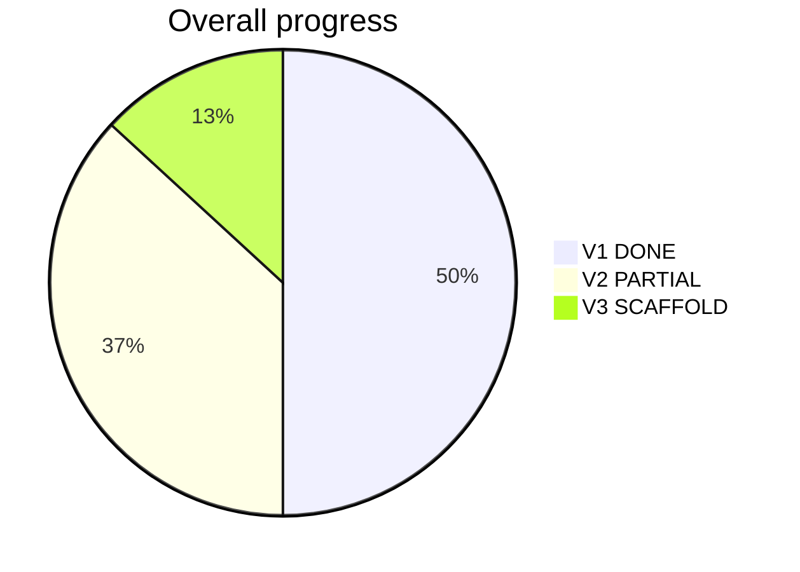

# ApplyFlow / PulseCV — Single Source of Truth

> Version 1.0 | Last Updated: June 2026

Professional project documentation for developers, designers, testers, and project managers.

## Status legend

| Symbol | Meaning |
|--------|---------|
| **DONE** | Implemented and usable in the repo |
| **PARTIAL** | Works but incomplete or env-dependent |
| **NOT DONE** | Not built or design only |
| **Suggested Solution** | Reasonable inference — not confirmed in specs |

## Live dashboard (June 2026)

| Version | Readiness | Focus |
|---------|-----------|-------|
| **V1 MVP** | ~95% — beta-ready | Prod extension URLs, job-site QA, `BETA_MAX_USERS=50` |
| **V2 Pro** | ~70% — scaffolded | Stripe live keys, plan gates, email reminders |
| **V3 Advanced** | ~25% — scaffolds | Job scraper, audio interview, enterprise billing |

---

## Table of contents

### Planning

- [Master Plan V1–V3](planning/MASTER_PLAN_V1-V3.md)

### Product (sections 1–8)

1. [Executive Summary](product/01-executive-summary.md)
2. [Project Scope](product/02-project-scope.md)
3. [Actors](product/03-actors.md)
4. [Functional Requirements](product/04-functional-requirements.md)
5. [Non-Functional Requirements](product/05-non-functional-requirements.md)
6. [User Stories](product/06-user-stories.md)
7. [Use Cases](product/07-use-cases.md)
8. [Feature List](product/08-feature-list.md)

### UX (sections 9–10)

9. [Screen Inventory](ux/09-screen-inventory.md)
10. [Navigation Flow](ux/10-navigation-flow.md)

### Technical (sections 11–16)

11. [Database Design](technical/11-database-design.md)
12. [API Documentation](technical/12-api-documentation.md)
13. [Business Rules](technical/13-business-rules.md)
14. [Validation Rules](technical/14-validation-rules.md)
15. [Architecture](technical/15-architecture.md)
16. [Folder Structure](technical/16-folder-structure.md)

### Delivery (sections 17–21)

17. [Development Roadmap](delivery/17-development-roadmap.md)
18. [Development Order](delivery/18-development-order.md)
19. [Module Implementation Plan](delivery/19-module-implementation-plan.md)
20. [Daily Development Plan](delivery/20-daily-development-plan.md)
21. [Project Checklist](delivery/21-project-checklist.md)

### Operations (sections 22–25)

22. [Risks](operations/22-risks.md)
23. [Missing Information](operations/23-missing-information.md)
24. [Suggested Improvements](operations/24-suggested-improvements.md)
25. [Time Estimation](operations/25-time-estimation.md)

### Resume (sections 26–28)

26. [Project Dashboard](resume/26-project-dashboard.md)
27. [Resume Development](resume/27-resume-development.md) — **start here if returning after a break**
28. [Coding Preparation](resume/28-coding-preparation.md)

---

## Quick links

| Resource | Path |
|----------|------|
| **Living task tracker** | [../TASKS.md](../TASKS.md) |
| Developer setup | [../README.md](../README.md) |
| Extension guide | [../extension/README.md](../extension/README.md) |
| Extension download | [../frontend/public/downloads/extension.zip](../frontend/public/downloads/extension.zip) |

---

*Single Source of Truth | v1.0 | Last Updated: June 2026*
