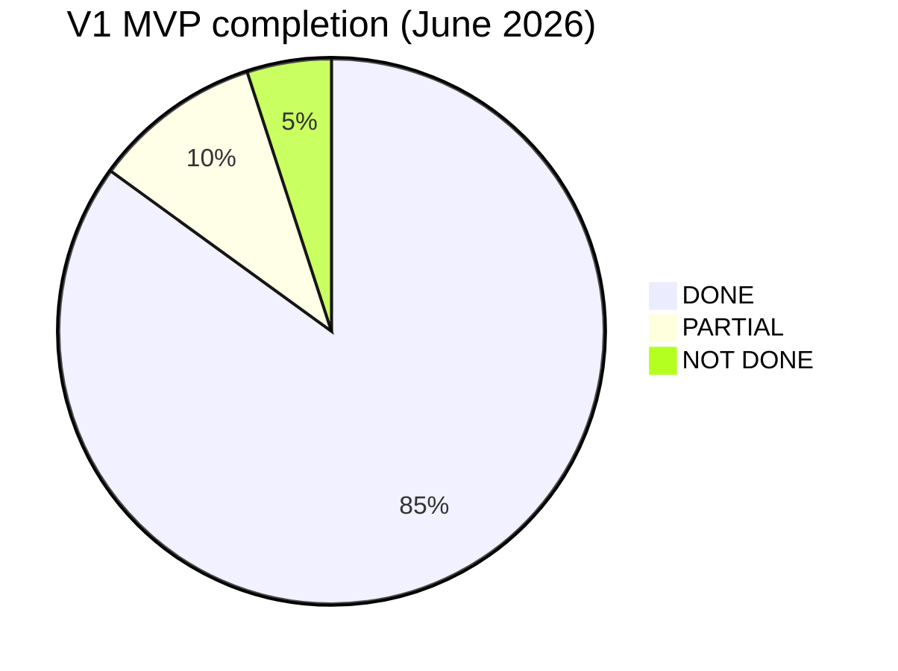
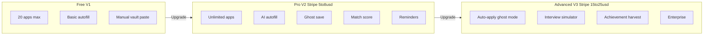

# ApplyFlow / PulseCV — Master Plan (V1 · V2 · V3)

**Last audited:** June 2026 — synced to codebase after implementation sprint.

## Product identity

| Item | Value |
|------|--------|
| **Product names** | ApplyFlow (app), PulseCV (pitch / deck), ApplyFlowo (marketing copy) |
| **One-liner** | Intelligent apply tracker + Chrome autofill for students and early-career job seekers |
| **Stack (built)** | Next.js 16, NestJS 11, MongoDB, Chrome MV3, JWT auth, Stripe SDK, OpenAI (optional) |
| **Stack (planned)** | Speech-to-Text (Whisper), Jira OAuth, LinkedIn API, job board scrapers |

---

## Important correction vs your strategy docs

Your pasted analysis says **Answer Vault is missing** and V1 only has basic profile. **That is outdated.**

The codebase now includes:

- Manual Answer Vault (web UI + extension AV floater + popup **Answers** button)
- **MongoDB vault sync** (`/answer-vault`, `/answer-vault/sync`)
- Multiple CVs + primary CV + **`cvUsed`** on applications
- Full Application Tracker V1 (CRUD, Kanban, filters, notes, deadline)
- Job title/company detection on autofill (bonus)
- **V2 scaffolds**: Stripe billing, ghost save, AI analyze-job, match score, in-app reminders
- **V3 scaffolds**: auto-apply queue, interview simulator (text), GitHub harvest, counselor dashboard

**Remaining before public production launch:** production extension URLs (still localhost), real job-site QA, `BETA_MAX_USERS=50` in `.env`, Stripe keys in `.env`, post-apply save prompt, email/push notifications.

---

## Status legend

| Symbol | Meaning |
|--------|---------|
| **DONE** | Implemented and usable |
| **PARTIAL** | Works but incomplete, local-only, env-dependent, or has gaps |
| **NOT DONE** | Not in codebase / design only |

---

# VERSION 1 — MVP (Foundation)

**Goal:** Free beta product — track applications + save time on forms.  
**Monetization (target):** Free, cap ~20 applications — **DONE** (enforced in `ApplicationsService`).

## V1 — Module map (your 9 modules vs reality)

### Module 1 — Authentication

| Feature | Status | Notes |
|---------|--------|-------|
| Register / login (email + password) | **DONE** | [`backend/src/auth`](backend/src/auth), [`frontend/app/login`](frontend/app/login/page.tsx) |
| JWT + HTTP-only cookies | **DONE** | `user_token` / `admin_token` |
| Logout | **DONE** | Web + extension |
| Forgot / reset password | **DONE** | Email optional (dev fallback) |
| Google OAuth | **PARTIAL** | Backend routes exist; [`/auth/callback`](frontend/app/auth/callback/page.tsx) **fixed** — needs prod Google credentials |
| Admin separate login | **DONE** | `/admin/login` |
| Beta user cap (50) | **PARTIAL** | `BETA_MAX_USERS` in [`auth.service.ts`](backend/src/auth/auth.service.ts) — set in `.env` |

### Module 2 — User Profile

| Feature | Status | Notes |
|---------|--------|-------|
| Name, email, phone, university | **DONE** | [`ProfileForm.tsx`](frontend/components/profile/ProfileForm.tsx) |
| LinkedIn, portfolio | **DONE** | |
| Country code | **DONE** | Extension autofill uses it |
| **Address** | **DONE** | Schema + profile form + extension autofill |
| Profile picture | **DONE** | Upload / delete |
| Single CV upload | **DONE** | Evolved to multi-CV |
| **Multiple CVs** | **DONE** | Upload, delete, set primary, preview |
| Skills field (structured) | **NOT DONE** | Only free-text in vault answers |
| Profile auto-create on signup | **DONE** | Created on register in `auth.service.ts` |

### Module 3 — Answer Vault (bridge feature — you wanted this in V1)

| Feature | Status | Notes |
|---------|--------|-------|
| Save text snippets by category | **DONE** | [`AnswerVaultSection.tsx`](frontend/components/profile/AnswerVaultSection.tsx) |
| Favorites, search, recent | **DONE** | |
| Click-to-paste on job sites | **DONE** | Floating **AV** button [`answer-vault.js`](extension/answer-vault.js) |
| **Answers button in extension popup** | **DONE** | [`popup.html`](extension/popup.html) + `fillAnswers` in [`content.js`](extension/content.js) |
| Backend persistence (sync across devices) | **DONE** | [`answer-vault/`](backend/src/answer-vault/) MongoDB + frontend sync |
| AI picks best answer | **DONE** | V2 — via `analyze-job` (OpenAI or heuristic fallback) |

### Module 4 — Application Tracker

| Feature | Status | Notes |
|---------|--------|-------|
| Kanban: Applied, Interview, Accepted, Rejected | **DONE** | [`/applicant`](frontend/app/applicant/page.tsx) |
| Company, job title, job link, status, date | **DONE** | Required |
| Notes | **DONE** | Required on create; per-card CRUD |
| Deadline | **DONE** | Optional |
| Source (manual / extension / ghost) | **DONE** | |
| CRUD + edit modal + delete | **DONE** | |
| Drag status change | **DONE** | |
| Search + status + source filters | **DONE** | |
| CV used per application | **DONE** | Add/edit modals + schema field |
| 20-application free cap | **DONE** | `ApplicationsService.assertCanCreateApplication` |

### Module 5 — Dashboard

| Feature | Status | Notes |
|---------|--------|-------|
| Total apps, charts, rates | **DONE** | [`/dashboard`](frontend/app/dashboard/page.tsx) |
| Recent activity | **PARTIAL** | Real data from API |
| Static “AI tips” | **PARTIAL** | Not real AI |
| Profile completion modal | **DONE** | |

### Module 6 — Chrome Extension (Basic Autofill)

| Feature | Status | Notes |
|---------|--------|-------|
| Manifest V3 | **DONE** | [`manifest.json`](extension/manifest.json) |
| Popup: Autofill | **DONE** | |
| Popup: Save Application | **DONE** | Manual form submit |
| Popup: Answers | **DONE** | Answers + Match buttons in popup |
| Detect input fields | **DONE** | name, id, placeholder, label (EN/FR) |
| Autofill: name, email, phone | **DONE** | |
| Autofill: linkedin, portfolio | **DONE** | |
| Autofill: address | **DONE** | [`content.js`](extension/content.js) |
| Autofill: textarea | **DONE** | Cover letter / why-us heuristics + vault fill |
| Autofill: select (general) | **PARTIAL** | Country code only |
| React-compatible fill (`setNativeValue`) | **DONE** | |
| Secure API (Bearer + `x-app-role`) | **DONE** | |
| Sync login from website | **DONE** | Cookies + sync button |
| CV upload to page | **DONE** | Bonus beyond basic spec |
| Job company/title detect | **DONE** | Bonus (H1, meta, ATS helpers) |
| Production URLs | **NOT DONE** | Hardcoded localhost in extension |
| `extension.zip` on download page | **DONE** | [`frontend/public/downloads/extension.zip`](frontend/public/downloads/extension.zip) |

### Module 7 — Save Application from Extension

| Feature | Status | Notes |
|---------|--------|-------|
| Manual save via popup form | **DONE** | `POST /extension/save-application` |
| Auto-fill job URL from tab | **DONE** | |
| **“Save this application?” prompt after apply** | **NOT DONE** | |
| **Ghost detection on Submit click** | **DONE** | V2 — `initGhostSubmitListener` → `POST /extension/ghost-save` |

### Module 8 — Reminders

| Feature | Status | Notes |
|---------|--------|-------|
| Deadline reminders | **PARTIAL** | In-app widget on `/applicant` — no email/push |
| Follow-up after 7 days | **PARTIAL** | In-app via [`RemindersService`](backend/src/reminders/reminders.service.ts) |
| Interview prep reminders | **PARTIAL** | In-app when status = interview |
| Email / push notifications | **NOT DONE** | |

### Module 9 — Analytics (basic)

| Feature | Status | Notes |
|---------|--------|-------|
| Dashboard stats (counts, rates) | **DONE** | |
| Acceptance / interview rates | **DONE** | Client-side from apps |
| CV version A/B performance | **PARTIAL** | `/reminders/cv-analytics` + widget (V2) |
| Best month / industry breakdown | **NOT DONE** | |

### Module 10 — Admin (beta ops)

| Feature | Status | Notes |
|---------|--------|-------|
| Stats, users, applications | **DONE** | |
| Feedback moderation | **DONE** | `AdminProtectedRoute` on feedback pages |
| `create-admin` endpoint unprotected | **DONE** | Guarded by `ADMIN_SETUP_SECRET` |

### Module 11 — Feedback

| Feature | Status | Notes |
|---------|--------|-------|
| User submit + attachments | **DONE** | |
| Admin reply + status | **DONE** | |

### Module 12 — Settings / i18n / marketing

| Feature | Status | Notes |
|---------|--------|-------|
| `/settings` page | **PARTIAL** | Billing section + account info; no notification prefs yet |
| EN / FR (web + extension) | **DONE** | |
| Landing page | **DONE** | Footer links placeholder |
| Extension install page | **DONE** | Zip file available |
| Presentation deck content | **NOT DONE** | You have script in docs, not in app |

### Module 13 — Billing (V1 free tier)

| Feature | Status | Notes |
|---------|--------|-------|
| Stripe Checkout | **PARTIAL** | Code done — needs `STRIPE_*` env vars |
| `/pricing` page | **DONE** | [`frontend/app/pricing/page.tsx`](frontend/app/pricing/page.tsx) |
| Plan limits enforcement | **PARTIAL** | 20-app cap done; AI/ghost not gated by plan yet |

---

## V1 summary scorecard

| Category | DONE | PARTIAL | NOT DONE |
|----------|------|---------|----------|
| Auth & profile | 11 | 2 | 1 |
| Answer Vault | 6 | 0 | 0 |
| Application tracker | 11 | 0 | 0 |
| Extension | 17 | 1 | 1 |
| Reminders & analytics | 2 | 4 | 2 |
| Billing & polish | 5 | 4 | 2 |

**Verdict:** V1 core loop (**profile → autofill → track**) is **~95% done** and **beta-ready**. Remaining: prod extension URLs, post-apply prompt, structured skills, email notifications, manual QA on real job sites.

---

# VERSION 2 — PRO (Intelligent upgrade · Stripe monetization)

**Goal:** Smart assistant users pay for.  
**Price target:** $5–8/month via **Stripe** subscription.

## V2 feature inventory (all ideas from your docs)

### A. Answer Vault Pro

| Feature | Status | Notes |
|---------|--------|-------|
| Multiple answers per category | **PARTIAL** | Already multiple; add role-type tags (PM vs SWE) |
| Backend sync (MongoDB) | **DONE** | [`answer-vault/`](backend/src/answer-vault/) |
| Cross-device + extension sync | **DONE** | Frontend sync on init + persist |
| Answer variations by job type | **NOT DONE** | Tags + UI |

### B. AI context-aware autofill

| Feature | Status | Notes |
|---------|--------|-------|
| Scrape job description from DOM | **DONE** | Page text via popup analyze |
| `POST /extension/analyze-job` | **DONE** | [`extension.controller.ts`](backend/src/extension/extension.controller.ts) |
| OpenAI: match vault answer to JD | **DONE** | [`ai.service.ts`](backend/src/ai/ai.service.ts) + heuristic fallback |
| Extension UI: suggested answers | **DONE** | Match button + auto-fillAnswers |
| Human-in-the-loop review before paste | **NOT DONE** | User confirms AI pick |
| Token cost caching per job board | **NOT DONE** | Your doc watch-out |

### C. Ghost application logging

| Feature | Status | Notes |
|---------|--------|-------|
| Listen for Submit / Apply Now buttons | **DONE** | [`content.js`](extension/content.js) |
| Auto `POST /extension/ghost-save` | **DONE** | |
| “Application saved!” toast | **NOT DONE** | Console log only |
| Dedupe same URL | **NOT DONE** | |

### D. Pre-submit Match Score

| Feature | Status | Notes |
|---------|--------|-------|
| Parse CV text from PDF | **NOT DONE** | pdf-parse or stored text |
| Compare CV vs JD (OpenAI) | **PARTIAL** | JD vs optional cvText; no PDF pipeline |
| 0–100% score in extension | **DONE** | Match panel in popup |
| Missing keywords bullet list | **DONE** | |
| “Add keyword before apply?” CTA | **NOT DONE** | |

### E. Enhanced profile & CV

| Feature | Status | Notes |
|---------|--------|-------|
| Multiple CVs | **DONE** | Already built |
| Smart CV suggestion per job | **NOT DONE** | AI picks primary CV |
| CV text extraction for matching | **NOT DONE** | |

### F. Smart reminders (V2 scope in your docs)

| Feature | Status | Notes |
|---------|--------|-------|
| Follow-up after 7 days | **PARTIAL** | In-app only |
| Deadline tomorrow alert | **PARTIAL** | In-app widget |
| Follow-up email templates | **NOT DONE** | |
| In-app notifications | **PARTIAL** | `RemindersWidget` on `/applicant` |

### G. Advanced analytics (V2)

| Feature | Status | Notes |
|---------|--------|-------|
| Success rate by CV version | **PARTIAL** | `/reminders/cv-analytics` |
| Success rate by answer / industry | **NOT DONE** | |
| Prove AI answers → more interviews | **NOT DONE** | Marketing data for V3 |

### H. Stripe billing (required for V2 revenue)

| Feature | Status | Notes |
|---------|--------|-------|
| User: `plan`, `stripeCustomerId`, `subscriptionStatus` | **DONE** | [`user.schema.ts`](backend/src/users/schemas/user.schema.ts) |
| `POST /billing/checkout` | **DONE** | Needs Stripe env |
| `POST /billing/webhook` | **DONE** | Raw body enabled in `main.ts` |
| Customer Portal | **DONE** | `POST /billing/portal` |
| `/pricing` page | **DONE** | |
| Free tier: 20 apps cap | **DONE** | |
| Premium gate on AI + ghost + match score | **NOT DONE** | Only app count gated |

### I. Other V2 ideas from your notes

| Idea | Status |
|------|--------|
| Auto-detect job offer page → “Track this” button | **PARTIAL** (job detect on autofill only) |
| Improve CV with AI | **NOT DONE** |
| Generate cover letter | **NOT DONE** |
| Suggest job matches | **NOT DONE** |
| Robust selector system (labels/ARIA not just id) | **PARTIAL** (already label-heavy; keep improving) |
| DOM stability watch-outs (Workday, LinkedIn) | **ONGOING** |

**V2 verdict:** **~70% code complete** — core revenue features scaffolded; needs Stripe keys, plan gates, PDF parsing, email reminders, production hardening.

---

# VERSION 3 — ADVANCED (Automated Career Agent)

**Goal:** Proactive career platform.  
**Price target:** $15–25/month individual; enterprise/university licensing.

## V3 feature inventory

### A. Ghost Mode auto-apply

| Feature | Status |
|---------|--------|
| User sets criteria (role, location, seniority) | **PARTIAL** — API [`/auto-apply/criteria`](backend/src/auto-apply/) |
| Job board API / scraper (NestJS) | **NOT DONE** |
| AI-tailored CV + cover letter per job | **NOT DONE** |
| One-click approve and send | **PARTIAL** — queue + approve at [`/auto-apply`](frontend/app/auto-apply/page.tsx) |
| Passive candidate scanning | **NOT DONE** |

### B. AI Interview Simulator

| Feature | Status |
|---------|--------|
| Generate 5 questions from saved JD | **DONE** — [`interview/`](backend/src/interview/) + [`/interview`](frontend/app/interview/page.tsx) |
| Web Audio API recording | **NOT DONE** |
| Whisper / STT transcription | **NOT DONE** |
| OpenAI grading + feedback | **PARTIAL** — text feedback heuristic + optional GPT questions |
| Webcam / tone analysis | **NOT DONE** |

### C. Achievement harvesting (“living resume”)

| Feature | Status |
|---------|--------|
| GitHub OAuth (read-only) | **NOT DONE** |
| GitHub public API harvest | **PARTIAL** — `POST /achievements/harvest/github` |
| Jira / Atlassian OAuth | **NOT DONE** |
| LinkedIn integration | **NOT DONE** |
| Webhooks (e.g. PR merged) | **NOT DONE** |
| AI draft resume bullet points | **NOT DONE** |
| Career journal auto-population | **PARTIAL** — journal CRUD API exists |

### D. Networking warm intro generator

| Feature | Status |
|---------|--------|
| LinkedIn mutual connections | **NOT DONE** |
| Draft outreach messages | **NOT DONE** |

### E. Enterprise / university

| Feature | Status |
|---------|--------|
| Counselor admin dashboard (with consent) | **PARTIAL** — [`/enterprise`](frontend/app/enterprise/page.tsx) + API |
| Bulk licenses | **NOT DONE** |
| Custom branding | **NOT DONE** |
| Student progress tracking | **PARTIAL** — aggregate stats only |

### F. Advanced analytics & A/B testing (V3)

| Feature | Status |
|---------|--------|
| Which CV / answers → most interviews | **PARTIAL** (cv-analytics only) |
| Recharts funnels Applied → Interview | **PARTIAL** (basic charts exist) |

**V3 verdict:** **~25% code complete** — scaffolds in place; full automation, audio interview, OAuth integrations not built.

---

# Monetization plan (Stripe)

| Tier | Price | Includes | Code status |
|------|-------|----------|-------------|
| **Free** | $0 | Tracker (20 cap), basic autofill, manual vault, 1 CV | **DONE** (cap enforced) |
| **Pro** | $5–8/mo | Unlimited, AI autofill, ghost save, match score, reminders, analytics | **PARTIAL** (needs Stripe env + plan gates) |
| **Advanced** | $15–25/mo | V3 automation + interview + harvesting | **PARTIAL** (scaffolds only) |
| **Enterprise** | Custom | University / career services | **PARTIAL** (counselor dashboard scaffold) |

---

# How the app works (step-by-step — your flow)

| Step | Description | Status |
|------|-------------|--------|
| 1 | User signs up, fills profile once | **DONE** |
| 2 | Upload CV + Answer Vault | **DONE** (MongoDB sync) |
| 3 | Install extension, sync token | **DONE** |
| 4 | On job form → Autofill fields | **DONE** (incl. address, textarea) |
| 5 | Click vault answer → paste into textarea | **DONE** |
| 6 | Submit on job site | User manual |
| 7 | Save application (manual or ghost) | **DONE** (manual popup + ghost on submit) |
| 8 | Kanban dashboard tracks status | **DONE** |
| 9 | Reminders & follow-up | **PARTIAL** (in-app only) |
| 10 | AI match score before submit | **DONE** (extension Match button) |
| 11 | Pay for Pro via Stripe | **PARTIAL** (code ready, needs keys) |

---

# Competitive positioning (from your analysis)

| Competitor | Their strength | ApplyFlow opportunity | Built? |
|------------|----------------|----------------------|--------|
| Simplify | Fast autofill | Context-aware answers (V2) | **PARTIAL** (analyze-job live) |
| Teal | Tracking CRM | Tracking + real autofill | **DONE** |
| Huntr | Kanban | Kanban + extension | **DONE** |
| Scale.jobs | Human apply | Affordable AI assistant | **PARTIAL** (auto-apply scaffold) |

**Your differentiator (V2 live in code):** intelligent autofill + ghost logging + match score at student-friendly price — **needs Stripe + prod deployment to monetize**.

---

# Recommended execution roadmap

## Phase 0 — V1 launch polish ✅ DONE (code)

1. ~~Fix [`/auth/callback`](frontend/app/auth/callback/page.tsx)~~ **DONE**
2. ~~Package [`extension.zip`](frontend/public/downloads/)~~ **DONE**
3. ~~Extension: popup Answers + textarea + address~~ **DONE**
4. ~~Admin: protect feedback routes + lock `create-admin`~~ **DONE**
5. ~~Enforce 20-app free cap~~ **DONE**
6. Beta: 50 users, fix extension on real job sites — **PARTIAL** (set `BETA_MAX_USERS=50`; manual QA pending)

## Phase 1 — V1.5 bridge ✅ DONE (code)

1. ~~Answer Vault → MongoDB~~ **DONE**
2. ~~`/settings`~~ **PARTIAL** (billing section; notification prefs TBD)
3. ~~Basic deadline reminders (in-app)~~ **DONE**
4. ~~`cvUsed` on applications~~ **DONE**

## Phase 2 — V2 Pro / Stripe — ~70% DONE

Priority order:

1. ~~Stripe checkout + webhooks + `/pricing`~~ **DONE** (env needed)
2. ~~Ghost application logging~~ **DONE**
3. ~~AI Answer Vault (`analyze-job`)~~ **DONE**
4. ~~Match Score in extension~~ **DONE**
5. Smart reminders + follow-up templates — **PARTIAL**
6. Analytics by CV version — **PARTIAL**

**Next:** Stripe live keys, plan gates on AI features, email reminders, PDF CV parsing, dedupe ghost saves.

## Phase 3 — V3 — ~25% DONE (scaffolds)

1. Interview simulator — **PARTIAL** (text only)
2. Achievement harvesting — **PARTIAL** (GitHub public API)
3. Ghost Mode auto-apply — **PARTIAL** (queue/approve)
4. Enterprise / university pilot — **PARTIAL** (counselor dashboard)

---

# All website pages (nothing missed)

| Route | Purpose | Status |
|-------|---------|--------|
| `/` | Landing / pitch | **DONE** |
| `/login`, `/signup` | Auth | **DONE** |
| `/forgot-password`, `/reset-password` | Password | **DONE** |
| `/auth/callback` | Google OAuth | **DONE** (needs prod OAuth config) |
| `/dashboard` | Stats overview | **DONE** |
| `/applicant` | Kanban tracker | **DONE** |
| `/profile` | Profile + CVs | **DONE** |
| `/profile?tab=vault` | Answer Vault | **DONE** (MongoDB sync) |
| `/feedback` | User feedback | **DONE** |
| `/extension` | Install guide | **DONE** |
| `/settings` | Preferences + billing | **PARTIAL** |
| `/pricing` | Stripe plans | **DONE** |
| `/auto-apply` | V3 ghost mode queue | **PARTIAL** |
| `/interview` | V3 interview sim | **PARTIAL** |
| `/achievements` | V3 career journal | **PARTIAL** |
| `/enterprise` | V3 counselor dashboard | **PARTIAL** |
| `/admin/*` | Admin panel | **DONE** |

---

# Presentation / soutenance talking points

Use this order for slides (from your script, aligned to real build):

1. **Problem** — job search gauntlet (repetition, disorganization, generic apps)
2. **Solution** — ApplyFlow command center (web + extension)
3. **V1 live demo** — profile, vault paste, autofill, Kanban (**all working**)
4. **V2 demo** — AI match score, ghost save, Stripe pricing page (**working in dev**)
5. **V3 vision** — auto-apply queue, interview sim, GitHub harvest (**scaffolds**)
6. **Tech** — Next.js, NestJS, MongoDB, MV3, OpenAI (optional), Stripe (configured in code)
7. **Business** — freemium → Pro → Advanced
8. **Call to action** — beta users, feedback loop

---

# Final verdict

| Version | Readiness | Next focus |
|---------|-----------|------------|
| **V1 MVP** | **~95% — beta-ready** | Prod URLs, job-site QA, `BETA_MAX_USERS=50` |
| **V2 Pro** | **~70% — code scaffolded** | Stripe live keys, plan gates, email reminders, PDF match |
| **V3 Advanced** | **~25% — scaffolds only** | Job scraper, audio interview, OAuth harvest, enterprise billing |

You are **past** the “basic tracker only” stage. You are **partially** at the “intelligent paid product” stage — V2 features exist in code but need production config and polish before charging users. Path forward: **deploy + Stripe live → polish V2 → build out V3 automation**.

