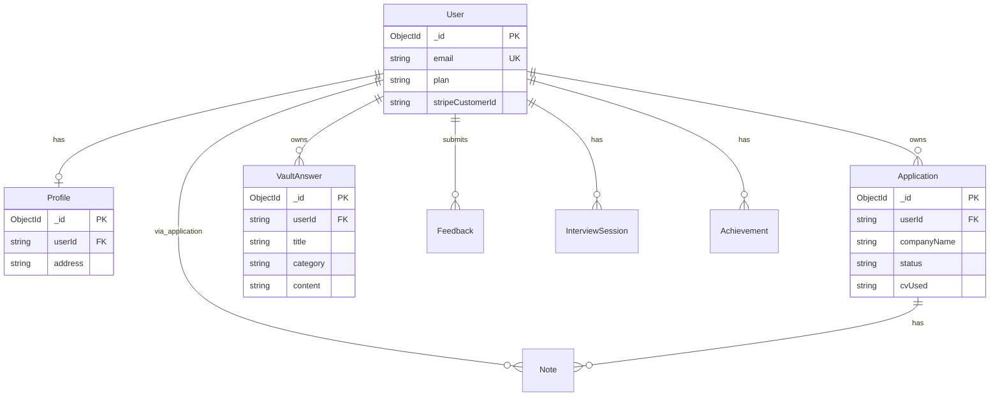

# 11. Database Design

[← Back to index](../README.md)

MongoDB via Mongoose. Primary key: `_id` (ObjectId) unless noted.

## Entity relationship

## Collections

### users

| Field | Type | Notes |
|-------|------|-------|
| `_id` | ObjectId | PK |
| `firstName`, `lastName` | String | Required |
| `email` | String | Unique, lowercase |
| `password` | String | Optional (Google users) |
| `googleId` | String | OAuth |
| `authProvider` | Enum | local, google |
| `role` | Enum | user, admin |
| `plan` | Enum | free, pro, advanced |
| `stripeCustomerId` | String | Stripe |
| `subscriptionStatus` | Enum | none, active, cancelled, past_due |
| `resetToken`, `resetTokenExpires` | String, Date | Password reset |

### profiles

| Field | Type | Notes |
|-------|------|-------|
| `userId` | String | FK → users, indexed |
| `firstName`, `lastName`, `email`, `phone` | String | |
| `countryCode`, `university`, `address` | String | |
| `linkedin`, `portfolio` | String | |
| `profilePictureUrl` | String | |
| `cvUrl`, `primaryCvId` | String | Legacy + multi-CV |

CV documents stored in separate `cvdocuments` collection (`cv-document.schema.ts`).

### applications

| Field | Type | Notes |
|-------|------|-------|
| `userId` | String | FK, must be string type |
| `companyName`, `position`, `jobUrl` | String | Required |
| `status` | Enum | applied, interview, accepted, rejected |
| `dateApplied` | Date | Required |
| `deadline` | Date | Optional |
| `source` | Enum | manual, extension (ghost via extension service) |
| `cvUsed` | String | Optional filename/label |

### vaultanswers (answer-vault)

Separate collection — **not** embedded in profile.

| Field | Type | Notes |
|-------|------|-------|
| `userId` | String | FK |
| `title`, `category`, `content` | String | |
| `favorite` | Boolean | Optional |

### notes

| Field | Type | Notes |
|-------|------|-------|
| `applicationId` | String | FK |
| `userId` | String | FK |
| `content` | String | |

### feedback

User submissions with optional attachment URL; admin reply fields.

### V3 collections

| Collection | Purpose |
|------------|---------|
| `interviewsessions` | Interview Q&A |
| `achievements`, `careerjournalentries` | Harvest + journal |
| `autoapplycriteria`, `autoapplyqueueitems` | Auto-apply |
| `organizations` | Enterprise |

## Indexes (recommended / partial)

- `users.email` — unique
- `applications.userId` + `status`
- `vaultanswers.userId`
- `applications.jobUrl` — **Suggested Solution** for ghost dedupe

## Design note

Original spec embedded `answerVault[]` on profile. **Implemented as** standalone `VaultAnswer` collection with `/answer-vault/sync` for bulk replace.

---

*Single Source of Truth | v1.0 | Last Updated: June 2026*
