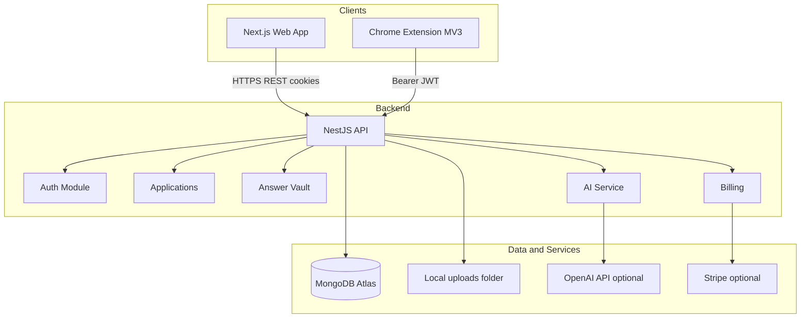

# 15. Recommended Architecture

[← Back to index](../README.md)

## Layer summary

| Layer | Technology | Rationale |
|-------|------------|-----------|
| Frontend | Next.js 16, React, Tailwind, shadcn/ui | App router, SSR for landing |
| Backend | NestJS 11, TypeScript | Modular REST API |
| Database | MongoDB + Mongoose | Flexible job-search schema |
| Auth | JWT + HTTP-only cookies | Shared with extension |
| Files | Local `/uploads` (dev) | **Suggested:** S3/R2 for prod |
| AI | OpenAI GPT-4o-mini | Optional; heuristic fallback |
| Payments | Stripe subscriptions | Checkout + webhooks |
| Extension | Manifest V3 | Chrome Web Store requirement |
| i18n | react-i18next + extension `_locales` | EN/FR |

## Deployment (**Suggested Solution**)

| Component | Dev | Production |
|-----------|-----|------------|
| Frontend | `localhost:3001` | Vercel |
| Backend | `localhost:3000` | Railway / Render / AWS |
| MongoDB | Atlas | Atlas |
| Extension | Unpacked | Chrome Web Store |

## Security boundaries

- CORS: frontend origins + `chrome-extension://`
- Role separation: `x-app-role: user|admin`
- Global ValidationPipe + HttpExceptionFilter
- Stripe webhook uses raw body parser

---

*Single Source of Truth | v1.0 | Last Updated: June 2026*
