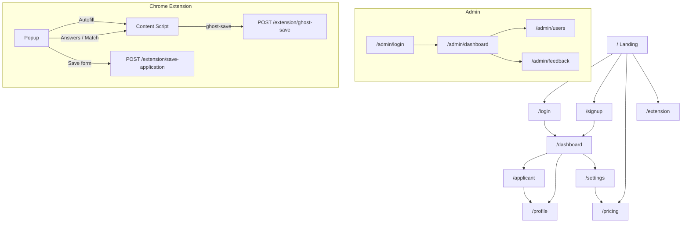

# 10. Navigation Flow

[← Back to index](../README.md)

## Primary user journeys

1. **Onboard:** Landing → Signup → Profile → Extension install page → Sync extension
2. **Apply:** Job site → Extension Autofill → (optional Match) → Submit → Ghost save → `/applicant`
3. **Track:** `/applicant` → drag card → edit modal → notes
4. **Upgrade:** `/pricing` → Stripe checkout → `/settings?billing=success`

## Sidebar / navbar (authenticated)

Typical links: Dashboard, Applicant (tracker), Profile, Settings, Feedback, Extension (external).

---

*Single Source of Truth | v1.0 | Last Updated: June 2026*
